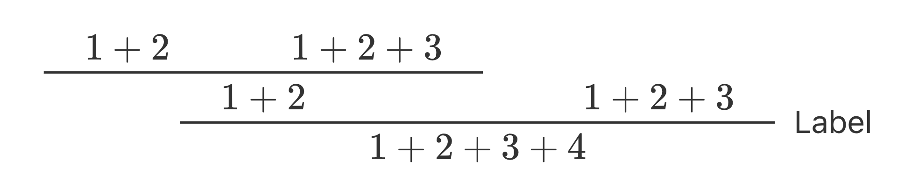
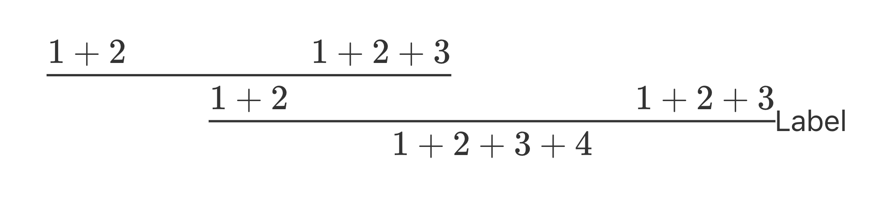

# bussproofs-html

A JavaScript engine to render bussproofs style proof tree in html.

[](https://github.com/sano-jin/bussproofs-html)

## Note

- Only proof trees directly under `p` elements are rendered.
- Only `\RightLabel` can be used for a label for now.
- Only `\AXC`, `\UIC`, `\BIC`, `\TIC`, and `\QuaternaryInfC` are allowed
  as a constcutor of the node of a proof tree.
- `\normalsize`, `\small`, `\footnotesize`, `\scriptsize`, and `\tiny`
  are ignored.
- No other LaTeX commands are allowed.

Send me PRs if you enable others.

## How to use:

### HTML

You can use this engine by adding a script tag as follows:

```html
<script type="module">
  import { renderProofTreesOnLoad } from "https://sano-jin.github.io/bussproofs-html/assets/prooftree.js";
  renderProofTreesOnLoad();
</script>
```

- html source: [demo/sample.html](./demo/sample.html)
- deployed page: <https://sano-jin.github.io/bussproofs-html/demo/sample.html>

> [!NOTE]  
> CSS class names starting from `bussproofs-html__` are reserved.

### markdown-preview.nvim

I forked [markdown-preview.nvim](https://github.com/iamcco/markdown-preview.nvim)
and integrated this rendering engine.
[Here](https://github.com/sano-jin/markdown-preview.nvim) is the forked previewer.
If you are using [Lazy](https://github.com/folke/lazy.nvim) as a plugin manager,
you can use the previewer as follows:

```lua
-- Lazy
  {
    "sano-jin/markdown-preview.nvim",
    cmd = { "MarkdownPreviewToggle", "MarkdownPreview", "MarkdownPreviewStop" },
    build = "cd app && yarn install",
    init = function()
      vim.g.mkdp_filetypes = { "markdown" }
    end,
    ft = { "markdown" },
  },
```


### Marp

You can use this engine by adding a script tag as follows:

```markdown
---
marp: true
math: katex
paginate: true
footer: https://github.com/sano-jin/bussproofs-html
---

# Integration with Marp is easy!

Here comes a proof tree:
\begin{prooftree}
\AXC{$1 + 2$}
\AXC{$1 + 2 + 3$}
\BIC{$1 + 2$}
\AXC{$1 + 2 + 3$}
\RightLabel{Label}
\BIC{$1 + 2 + 3 + 4$}
\end{prooftree}

<script type="module">
  import { renderProofTreesOnLoad } from "https://sano-jin.github.io/bussproofs-html/assets/prooftree.js";
  renderProofTreesOnLoad();
</script>
```


- markdown: [demo/marp-sample.md](./demo/marp-sample.md)
- output pdf: [demo/marp-sample.pdf](./demo/marp-sample.pdf)

### VSCode

I'm not familiar with VSCode so I have not yet considered any integration plan.
Please send me PR if you made any progress.

## Configration options

You can pass configration options `configP`
to `renderProofTreesOnLoad` and `renderProofTrees`.

```ts
interface configP {
  // the margin between premises (default is 20).
  marginPremises?: number;

  // the left and right padding of an axiom and conclusion (default is 20).
  paddingAxiomConclusion?: number;

  // the left margin of a label (default is 10).
  marginLabelLeft?: number;

  // when to apply styles; after load (on null) or manually set timeout (on number) (default is null).
  styleOnLoad?: null | number;
}
```

For example,
if you specify the configration as follows,
the margin between premises will be 100px,
the left and right padding of an axiom and conclusion will be 0px,
the left margin of a label will be 0px,
and
the style will be applied after 100 milliseconds.

```ts
renderProofTreesOnLoad({
  marginPremises: 100,
  paddingAxiomConclusion: 0,
  marginLabelLeft: 0,
  styleOnLoad: 100,
});
```



## For developpers: how to build

Develop:

```bash
cd proof-tree
yarn dev
# access the displayed url on your browser.
```

Deploy:

```bash
cd proof-tree
yarn build
cd ..
cp proof-tree/dist/index.js docs/assets/prooftree.js
```

## Roadmap

I have a folloing roadmap.
Please send me PR if you made any progress.

1. Enable `\LeftLabel`.
2. Add VSCode integration.
3. Make the styling process robust.
   - To style a proof tree,
     the width of the nodes of the proof tree are obtained after the first HTML rendering.
   - Currently, we have two options for timing the styling:
     - A: style after the `load` event or
     - B: style after user-specified milliseconds
       after the insertion of the DOM elements of a proof tree.
   - (B) Styling after user-specified milliseconds is not a robust way
     since we cannot precisely predict how long does it take to render
     the inserted DOM elements.
     If we try to style before the completion of the rendering,
     we cannot get an expected result.
   - (A) Styling after `load` event,
     which is fired after DOM contents are fully rendered
     in my understanding,
     is a more robust method and it should work.
     However, in some cases it seems not to work:
     e.g., in the integration with markdown-preview.nvim.
     A deeper and more comprehensive understanding is needed.
4. Release the first version.
